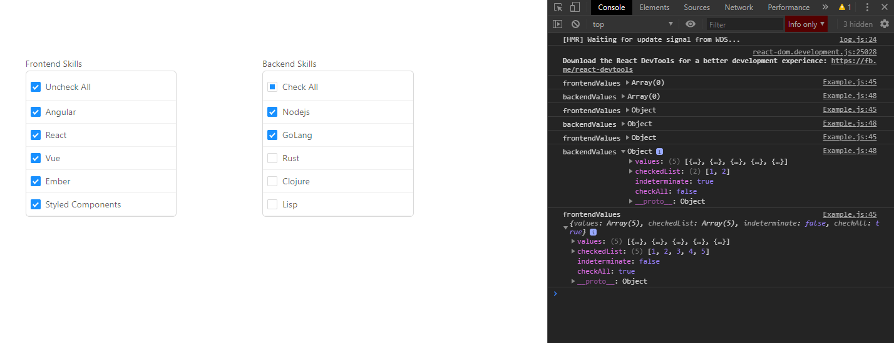

  

# Motivation
TL/DR: I needed to componentize this kind of behavior in a project, but antd itself doesn't have a decent preset with vertical list, so I created my own version-look-alike of their lib, using the some default components like Row/Cow/Checkbox and Checkbox.Group.

Also, this project structure was taken in mind to place two find fields/debouncer in each picklist, so each time you search on the box, the container updates the value of the component. The finder box isn't here yet, but I think I'll add later on, too.

Also: there's some comments there, explaining how things works. You should be fine.

That's it. Any doubts, contact me on Twitter/LinkedIn. o/

# How to

### To start the project, do the following

clone the repo: `git clone https://github.com/devMozao/dynamic-checkbox-group-with-react-and-antd.git`

navigate to the folder: ` cd dynamic-checkbox-group-with-react-and-antd`

install the project dependencies with: `yarn` or `npm install` (yarn is recommended)

and then, just run the project with the start script: `yarn start` or `npm run start`

If you open the console on the broser, you will see the logs from the values that are currently showing and being selected.

### If you want to see the content of the code

go to

 `src/App.js`

there, you will find the container import, located at 

`src/containers/example.js`

from the container, you'll see the import to the component located at 

`src/ccomponents/customCheckboxGroup/CustomCheckboxGroup.js` 

This is where all the magic happens between container and component ;)

# About

author: Diogo "Mozão" Fonseca

twitter/linkedin: @devmozao

# License

Feel free to fork, improve or contribute.For license details, check the LICENSE.md file.

